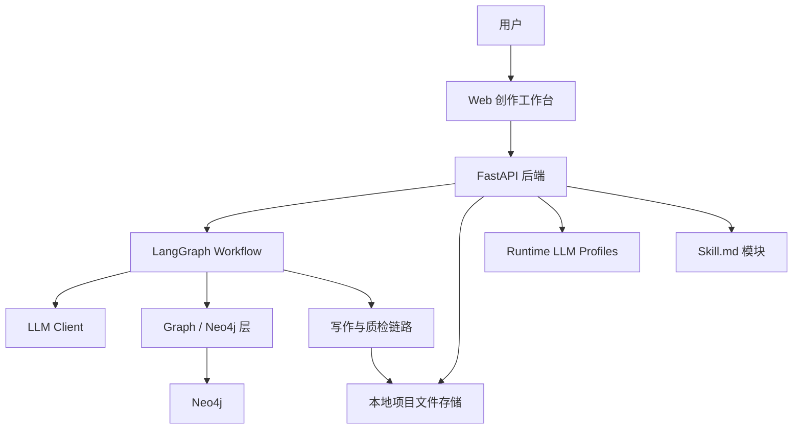

# Novel-Assistant 项目总规划与实施路线

## 1. 项目定位

Novel-Assistant 是一个面向长篇小说创作的智能体系统，目标不是做简单的文本生成器，而是做一套可持续迭代的小说创作工作台。

系统需要支持从用户创意出发，自动生成小说蓝图、主角设定、世界观、章节大纲和正文草稿；同时通过质检、Skill 润色、人工编辑确认和图谱回写，形成一个可追踪、可修正、可扩展的创作闭环。

核心闭环：

```text
用户创意
-> AI 梳理需求
-> 小说蓝图
-> 人物 / 世界观 / 大纲
-> 图谱写入
-> 章节生成
-> 质检报告
-> Skill 润色
-> 人工编辑
-> 确认保存 final.md
-> 状态 / 事件 / 伏笔回写
```

## 2. 当前已完成内容

### 2.1 后端基础能力

当前项目已经完成以下后端能力：

- FastAPI 后端服务基础结构。
- LLM Client 与模型配置读取。
- Runtime LLM Profile 管理。
- 项目创建、项目列表、项目详情接口。
- 大纲与章节读取接口。
- 单章草稿生成接口。
- 多章节批量草稿生成接口。
- LangGraph 小说生成 workflow。
- Workflow 运行状态持久化。
- Skill 文件加载与 Skill 应用接口。
- 章节正文读取接口。
- 人工确认后保存最终 Markdown 文件。
- `.env`、运行时 profile、workflow run、project 产物均已按规则避免提交。

### 2.2 已有核心 API

LLM 配置：

```text
GET    /llm/profiles
POST   /llm/profiles
PUT    /llm/profiles/{profile_id}
DELETE /llm/profiles/{profile_id}
```

项目与章节：

```text
POST /projects
GET  /projects
GET  /projects/{project_id}
GET  /projects/{project_id}/outline
GET  /projects/{project_id}/chapters
POST /projects/{project_id}/chapters/{chapter_number}/draft
POST /projects/{project_id}/chapters/draft-batch
GET  /projects/{project_id}/chapters/{chapter_number}/content
POST /projects/{project_id}/chapters/{chapter_number}/confirm
```

Workflow：

```text
POST /workflows/novel-generation
GET  /workflows/{workflow_id}
```

Skill：

```text
GET  /skills
POST /skills/apply
```

### 2.3 当前保存策略

章节内容保存策略已经明确：

- AI 生成草稿可作为工作中间态。
- Skill 润色结果先返回给前端编辑器。
- 用户可以在正文编辑器中人工修改。
- 只有用户点击确认保存时，才保存最终 `.md` 文件。
- 最终文件允许用户自定义文件名。
- 不自动保存多个 final 版本，避免产物混乱。

推荐文件流：

```text
AI draft
-> Skill polish result
-> editor content
-> user edits
-> confirm
-> final custom_name.md
```

## 3. 总体架构



### 3.1 后端

后端负责：

- API 编排。
- workflow 执行。
- LLM profile 管理。
- Skill 应用。
- 章节内容保存。
- 质检与修改建议结构化。
- 图谱和时间线数据出口。

### 3.2 Workflow

LangGraph 不直接承担图谱数据库职责，它负责流程编排：

```text
需求分析
-> 蓝图生成
-> 人物生成
-> 世界观生成
-> 大纲生成
-> 图谱写入
-> 章节计划
-> 正文生成
-> 质检
-> 修订 / 接受
-> 图谱 delta 抽取
-> 状态回写
```

### 3.3 Neo4j

Neo4j 用于保存小说长期知识：

- 人物。
- 势力。
- 地点。
- 世界规则。
- 章节。
- 事件。
- 伏笔。
- 人物关系。
- 事件因果。
- 章节推进关系。

### 3.4 前端

前端定位为创作工作台，而不是营销页。

核心页面：

```text
项目首页
创作工作台
小说蓝图页
图谱中心
设置页
```

## 4. Subagent 分工

项目采用“总监 + 多 subagent 协作”方式推进。

### 4.1 CoreAgent

职责：

- FastAPI 接口。
- LangGraph workflow。
- workflow run 状态。
- 项目与章节存储。
- 后端测试。

主要关注文件：

```text
src/novel_assistant/api.py
src/novel_assistant/workflow.py
src/novel_assistant/workflow_runs.py
src/novel_assistant/storage.py
tests/test_api.py
tests/test_workflow.py
tests/test_workflow_runs.py
tests/test_storage.py
```

### 4.2 GraphAgent

职责：

- Neo4j schema。
- 图谱存储接口。
- 人物关系图。
- 世界观图谱。
- 小说事件时间线。
- 图谱导出 JSON。
- 图谱冲突检测。

建议图谱核心节点：

```text
Novel
Character
Faction
Location
WorldRule
Arc
Chapter
Event
Hook
Theme
```

### 4.3 WritingAgent

职责：

- 小说蓝图生成。
- 人物设定生成。
- 世界观生成。
- 章节计划。
- 正文生成。
- 质检报告。
- Skill 润色。
- 去 AI 味。
- 章节事实抽取。

质检维度：

```text
人设一致性
世界观一致性
人物关系一致性
事件因果
伏笔推进
大纲对齐
节奏
重复表达
AI 味
敏感内容
```

### 4.4 FrontendAgent

职责：

- React 前端工程。
- 项目首页。
- 创作工作台。
- 右侧 Inspector。
- 图谱中心。
- 时间线视图。
- 设置页。
- API client。

## 5. UI 产品规划

### 5.1 项目首页

项目首页建议包含：

- 项目列表。
- 新建项目入口。
- 智能体对话区。
- 灵感整理区。
- 最近 workflow 运行状态。
- 当前 LLM / Skill 状态提示。

智能体对话区的定位：

```text
用户有灵感时，可以先和 AI 聊，把想法梳理成可创建项目的小说需求。
```

### 5.2 创作工作台

创作工作台是 MVP 最重要页面。

布局：

```text
顶部工具栏：
保存 final、重新质检、一键润色、版本历史、Skill 选择、文件名输入

左侧：
章节列表、章节状态、生成状态

中间：
正文 Markdown 编辑器

右侧：
质检报告、修改建议、人物图谱预览、Workflow 运行状态
```

右侧建议做成 Inspector Tab：

```text
质检报告 | 修改建议 | 人物图谱 | 运行状态
```

不要把完整大图谱塞进右侧，右侧只做当前章节相关预览。

### 5.3 图谱中心

图谱中心应独立成页。

推荐 Tab：

```text
人物图谱
世界图谱
剧情时间线
章节结构
伏笔线索
```

图谱中心负责完整可视化，创作工作台右侧只负责局部上下文。

### 5.4 设置页

设置页包含：

- LLM profile 管理。
- Skill 列表。
- Skill 启用状态。
- Neo4j 连接状态。
- API Base URL。
- 本地运行状态。

## 6. 小说世界时间线

小说世界时间线建议作为图谱中心核心视图之一。

它解决的问题：

- 事件先后顺序。
- 角色在某个时间点知道什么。
- 伏笔什么时候埋。
- 伏笔什么时候回收。
- 多条剧情线是否冲突。
- 世界观历史是否和正文冲突。

时间线事件建议字段：

```json
{
  "event_id": "evt_001",
  "title": "主角第一次获得线索",
  "summary": "主角发现旧案与当前危机有关。",
  "time_label": "第一卷 第三章",
  "sequence_order": 30,
  "chapter_number": 3,
  "event_type": "foreshadowing",
  "participants": ["char_main"],
  "location": "旧城区",
  "consequence": "引出幕后势力",
  "related_event_ids": ["evt_009"],
  "status": "planned"
}
```

时间线应和质检联动：

- 质检发现时间矛盾时，定位到时间线事件。
- 写新章节前，workflow 可以读取相关事件。
- 用户修改时间线后，系统提示受影响章节。
- 伏笔回收表可以从时间线事件中自动生成。

## 7. 后续实施路线

### Phase 1：前端基础工程

目标：

- 创建 React + Vite + TypeScript 前端。
- 接入现有后端 API。
- 完成基础路由、API client、加载态、错误态。

验收：

```text
前端能启动
能读取项目列表
能访问后端 API
前端 build 通过
后端 pytest 通过
```

### Phase 2：创作工作台 MVP

目标：

- 左侧章节列表。
- 中间正文编辑器。
- 右侧 Inspector。
- 顶部操作栏。
- Skill 润色。
- final `.md` 保存。

验收：

```text
用户能打开章节
用户能编辑正文
用户能一键润色
用户能确认保存 final.md
不会自动保存多个最终文件
```

### Phase 3：设置页

目标：

- 前端配置 LLM profiles。
- 前端查看 Skill。
- 前端查看 Neo4j 状态。

验收：

```text
用户能在 UI 中切换模型配置
不需要每次手动改 .env
前端不展示已保存的真实 API Key
```

### Phase 4：Workflow 状态可视化

目标：

- 右侧运行状态 Tab。
- workflow 时间线。
- running / completed / failed 状态。
- 失败原因展示。

验收：

```text
用户知道系统正在执行哪一步
用户知道失败发生在哪一步
用户能看到运行结果
```

### Phase 5：图谱中心

目标：

- 人物图谱。
- 世界图谱。
- 章节结构。
- 伏笔线索。
- 图谱节点详情。

验收：

```text
图谱可以加载
节点可以点击
关系可以筛选
右侧显示节点详情
```

### Phase 6：剧情时间线

目标：

- 时间线事件 CRUD。
- 事件关联章节、人物、地点。
- 事件类型筛选。
- 时间线和质检报告关联。

验收：

```text
用户能查看小说事件顺序
用户能新增和修改事件
用户能看到事件关联章节
质检能引用时间线事件
```

### Phase 7：质检联动增强

目标：

- 质检问题关联正文段落。
- 质检问题关联图谱节点。
- 质检问题关联时间线事件。
- 修改建议可应用到编辑器。

验收：

```text
质检报告不只是文字
用户可以从问题跳转到正文、图谱或时间线
建议可以应用或忽略
```

## 8. 推荐执行顺序

```text
1. 前端基础工程
2. 创作工作台 MVP
3. LLM / Skill 设置页
4. Workflow 状态可视化
5. 图谱中心
6. 小说世界时间线
7. 质检联动增强
8. 项目首页智能体对话增强
9. 文档和发布整理
```

原因：

- 创作工作台是产品核心，优先级最高。
- LLM / Skill 设置影响真实使用体验，应该尽早做。
- 图谱和时间线价值很高，但依赖前端基础能力。
- 智能体对话适合作为首页增强，不应该阻塞主工作台。

## 9. MVP 验收标准

下一版 MVP 完成后，应满足：

- 用户可以打开前端。
- 用户可以查看项目列表。
- 用户可以进入创作工作台。
- 用户可以选择章节。
- 用户可以查看和编辑正文。
- 用户可以选择 Skill 并润色正文。
- 用户可以查看质检报告。
- 用户可以查看修改建议。
- 用户可以确认保存最终 `.md` 文件。
- 用户可以查看 workflow 运行状态。
- 用户可以进入图谱中心。
- 用户可以查看剧情时间线。
- 后端测试通过。
- 前端构建通过。

## 10. 风险控制

- 不提交 `.env`。
- 不提交运行时 API Key。
- 不让前端保存明文 API Key。
- 不自动生成多个 final 文件。
- 不让 LLM 直接输出 Cypher 并写入 Neo4j。
- 不让 Skill 润色结果直接覆盖用户编辑内容。
- 不在创作工作台右侧塞完整复杂图谱。
- 不把时间线做成装饰图，必须服务生成和质检。

## 11. 文档整理建议

本文件作为后续主文档使用。

建议保留原有文档作为历史记录：

```text
docs/project-planning-report.md
docs/subagent-integrated-architecture.md
docs/ui-initial-design.md
docs/superpowers/plans/2026-06-01-novel-assistant-next-stage.md
```

后续新规划优先更新本文件，详细执行计划可以继续放入：

```text
docs/superpowers/plans/
```

